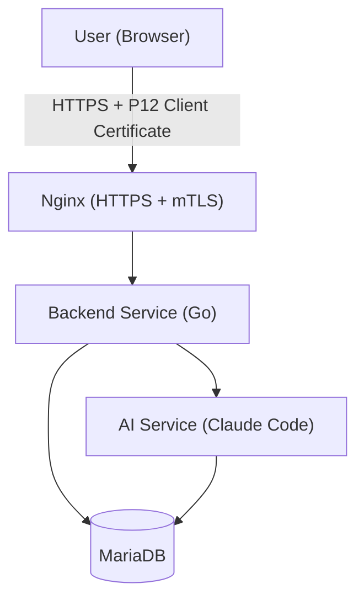

# System Overview

The Foodaura backend is a Go HTTP service that manages users, households, meal plans, recipes, and shopping lists. It follows an MVC architecture and uses server-side rendering — the backend renders HTML directly and delivers complete pages to the browser, with no separate frontend build step or client-side framework. Domain logic (recipe scaling, shopping list derivation, meal plan rules, nutritional calculations) lives in MariaDB stored procedures so that both the backend and the AI service can call the same logic regardless of which component initiates the operation.

## Component Diagram

## Components

**User (Browser)**
The web client. All requests are authenticated with a P12 client certificate issued per user, enforced at the Nginx layer.

**Nginx**
Terminates HTTPS and validates the client certificate (mTLS). Acts as the only public entry point — the backend is not directly reachable. Also handles TLS termination so the backend speaks plain HTTP internally. mTLS is a temporary measure to keep the application hidden while it is not yet fully production-ready or security-tested; it will be removed once the application has gone through a proper security review.

**Backend Service (Go)**
Follows MVC: controllers handle HTTP requests, models call MariaDB stored procedures and return data to the controller, views are server-rendered HTML templates. Business logic is not duplicated in the Go layer — the backend delegates to stored procedures for any operation with domain rules.

**AI Service (Claude Code)**
Responsible for AI-driven meal plan generation and recipe recommendations. Reads from the database directly to access user profiles and nutritional data. Does not write — all persistence goes through the backend.

**MariaDB**
The primary datastore and the home for domain logic. Holds all application data: users, households, profiles, recipes, meal plans, and shopping lists. Stored procedures implement the business rules shared by both the backend and the AI service — recipe scaling, shopping list derivation, meal plan generation rules, and nutritional calculations.

## External Dependencies

**Claude Code (Anthropic)**
Runs in its own Docker container and is invoked by the backend service to power AI-driven meal plan generation and recipe recommendations. Containerisation limits its access to the host system and prevents it from corrupting other services or the server itself.

## Deployment

The application runs on a single VPS. Deployment is managed with Ansible. Nginx, MariaDB, the Backend Service, and Claude Code each run as a containerised Docker image on the same host.

## Key Invariants

- All user data is scoped to a household — no data crosses household boundaries.
- All domain logic is enforced by stored procedures; neither the backend nor the AI service re-implements rules in application code.
- Every external request must carry a valid P12 client certificate until mTLS is removed; unauthenticated requests are rejected at the Nginx layer before reaching the backend.
