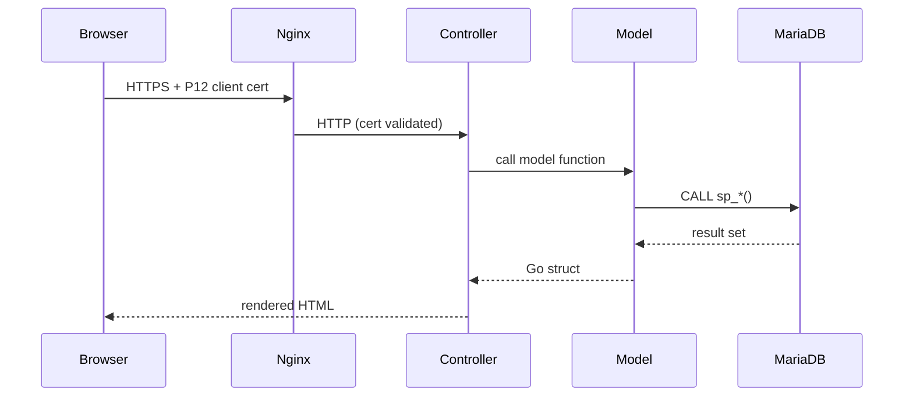
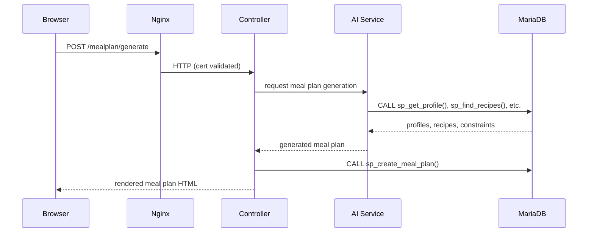
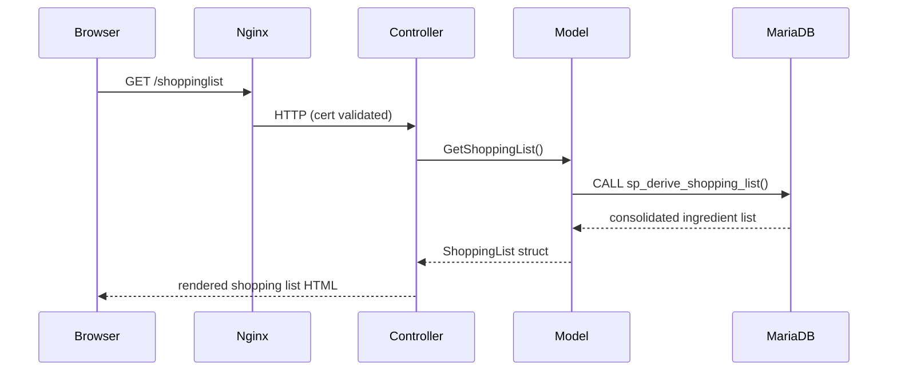

# Data Flow

## Standard Request

Every browser request passes through Nginx before reaching the backend. Nginx terminates HTTPS and validates the P12 client certificate; requests without a valid certificate are rejected before touching the backend.

Within the backend, the MVC layers have strict separation:

- **Controller** — parses and validates HTTP input, calls the relevant model function, selects a template, and renders the response. No business logic.
- **Model** — calls the appropriate stored procedure and scans the result into a Go struct. No HTTP awareness.
- **View** — Go `html/template` file. Receives a plain struct. No logic beyond conditionals and iteration.

---

## AI Meal Plan Generation

Meal plan generation is the only flow involving the AI service. The user triggers generation via the backend; the backend delegates to the AI service, which reads household and profile data directly from the database via stored procedures. The AI service returns a plan to the backend, which persists it by calling the relevant stored procedure.

The AI service reads directly from MariaDB rather than calling the backend API. This avoids coupling the AI service to the backend's HTTP surface and lets it access any data it needs. All writes go through the backend — the AI service does not write to the database.

---

## Shopping List Derivation

When the user requests their shopping list, the backend calls a single stored procedure that derives and consolidates the list from the active meal plan. Ingredient consolidation and unit normalisation are handled entirely in the database.

---

## Recipe Scaling

When a recipe is viewed in the context of a meal plan slot, the backend calls `sp_scale_recipe` with the identifiers of the household members eating that meal. The stored procedure returns quantities already adjusted to the relevant nutritional targets — the Go layer does no scaling arithmetic.

---

## Key Invariants

- All data is scoped to a household; no stored procedure returns data across household boundaries.
- All domain logic (scaling, consolidation, generation rules, nutritional calculations) executes in stored procedures. Neither the backend nor the AI service re-implements these rules in application code.
- The AI service reads from MariaDB directly. All writes, including persisting AI-generated meal plans, go through the backend.
- Nginx is the sole public entry point. All external traffic must carry a valid P12 client certificate.
