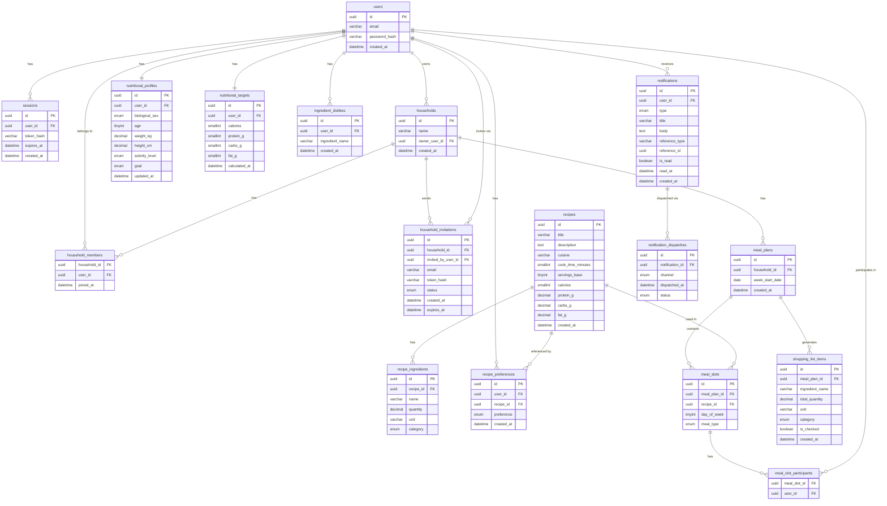

# Database Schema

## Entity Relationship Diagram



---

## Users & Auth

```sql
users (
  id            CHAR(36) NOT NULL DEFAULT (UUID()),
  email         VARCHAR(255) NOT NULL UNIQUE,
  password_hash VARCHAR(255) NOT NULL,
  created_at    DATETIME NOT NULL DEFAULT CURRENT_TIMESTAMP
)

sessions (
  id         CHAR(36) NOT NULL DEFAULT (UUID()),
  user_id    CHAR(36) NOT NULL REFERENCES users(id),
  token_hash VARCHAR(255) NOT NULL UNIQUE,
  expires_at DATETIME NOT NULL,
  created_at DATETIME NOT NULL DEFAULT CURRENT_TIMESTAMP
)
```

---

## Households

```sql
households (
  id            CHAR(36) NOT NULL DEFAULT (UUID()),
  name          VARCHAR(255) NOT NULL,
  owner_user_id CHAR(36) NOT NULL REFERENCES users(id),
  created_at    DATETIME NOT NULL DEFAULT CURRENT_TIMESTAMP
)

-- The owner is also a row in this table
household_members (
  household_id CHAR(36) NOT NULL REFERENCES households(id),
  user_id      CHAR(36) NOT NULL REFERENCES users(id),
  joined_at    DATETIME NOT NULL DEFAULT CURRENT_TIMESTAMP,
  PRIMARY KEY (household_id, user_id)
)

household_invitations (
  id                 CHAR(36) NOT NULL DEFAULT (UUID()),
  household_id       CHAR(36) NOT NULL REFERENCES households(id),
  invited_by_user_id CHAR(36) NOT NULL REFERENCES users(id),
  email              VARCHAR(255) NOT NULL,
  token_hash         VARCHAR(255) NOT NULL UNIQUE,
  status             ENUM('pending', 'accepted', 'expired') NOT NULL DEFAULT 'pending',
  created_at         DATETIME NOT NULL DEFAULT CURRENT_TIMESTAMP,
  expires_at         DATETIME NOT NULL
)
```

---

## Nutritional Profiles & Targets

```sql
-- Inputs: what the user tells us about themselves
nutritional_profiles (
  id             CHAR(36) NOT NULL DEFAULT (UUID()),
  user_id        CHAR(36) NOT NULL UNIQUE REFERENCES users(id),
  biological_sex ENUM('male', 'female') NOT NULL,
  age            TINYINT UNSIGNED NOT NULL,
  weight_kg      DECIMAL(5,2) NOT NULL,
  height_cm      DECIMAL(5,2) NOT NULL,
  activity_level ENUM('sedentary', 'light', 'moderate', 'active', 'very_active') NOT NULL,
  goal           ENUM('lose_weight', 'maintain', 'build_muscle', 'eat_better') NOT NULL,
  updated_at     DATETIME NOT NULL DEFAULT CURRENT_TIMESTAMP ON UPDATE CURRENT_TIMESTAMP
)

-- Outputs: calculated from the profile, stored for fast access.
-- Recalculated by stored procedure whenever nutritional_profiles is updated.
nutritional_targets (
  id            CHAR(36) NOT NULL DEFAULT (UUID()),
  user_id       CHAR(36) NOT NULL UNIQUE REFERENCES users(id),
  calories      SMALLINT UNSIGNED NOT NULL,
  protein_g     SMALLINT UNSIGNED NOT NULL,
  carbs_g       SMALLINT UNSIGNED NOT NULL,
  fat_g         SMALLINT UNSIGNED NOT NULL,
  calculated_at DATETIME NOT NULL DEFAULT CURRENT_TIMESTAMP
)
```

---

## Recipes

```sql
recipes (
  id                CHAR(36) NOT NULL DEFAULT (UUID()),
  title             VARCHAR(255) NOT NULL,
  description       TEXT,
  cuisine           VARCHAR(100),
  cook_time_minutes SMALLINT UNSIGNED,
  servings_base     TINYINT UNSIGNED NOT NULL,  -- base number of servings the nutrition values are based on
  calories          SMALLINT UNSIGNED NOT NULL,
  protein_g         DECIMAL(6,2) NOT NULL,
  carbs_g           DECIMAL(6,2) NOT NULL,
  fat_g             DECIMAL(6,2) NOT NULL,
  created_at        DATETIME NOT NULL DEFAULT CURRENT_TIMESTAMP
)

-- Structured enough for shopping list consolidation; no central ingredient library.
-- category drives how shopping list items are grouped.
recipe_ingredients (
  id          CHAR(36) NOT NULL DEFAULT (UUID()),
  recipe_id   CHAR(36) NOT NULL REFERENCES recipes(id),
  name        VARCHAR(255) NOT NULL,
  quantity    DECIMAL(8,3) NOT NULL,
  unit        VARCHAR(50) NOT NULL,   -- e.g. g, ml, tbsp, piece
  category    ENUM('produce', 'protein', 'dairy', 'pantry', 'frozen', 'bakery', 'other') NOT NULL
)
```

---

## Recipe Preferences

```sql
-- Per user, carries across all households they belong to
recipe_preferences (
  id         CHAR(36) NOT NULL DEFAULT (UUID()),
  user_id    CHAR(36) NOT NULL REFERENCES users(id),
  recipe_id  CHAR(36) NOT NULL REFERENCES recipes(id),
  preference ENUM('like', 'dislike') NOT NULL,
  created_at DATETIME NOT NULL DEFAULT CURRENT_TIMESTAMP,
  UNIQUE (user_id, recipe_id)
)

-- Ingredient-level dislikes; matched against recipe_ingredients.name
ingredient_dislikes (
  id              CHAR(36) NOT NULL DEFAULT (UUID()),
  user_id         CHAR(36) NOT NULL REFERENCES users(id),
  ingredient_name VARCHAR(255) NOT NULL,
  created_at      DATETIME NOT NULL DEFAULT CURRENT_TIMESTAMP,
  UNIQUE (user_id, ingredient_name)
)
```

---

## Meal Plans

```sql
-- One meal plan per household per week. History is kept — past plans are never deleted.
meal_plans (
  id              CHAR(36) NOT NULL DEFAULT (UUID()),
  household_id    CHAR(36) NOT NULL REFERENCES households(id),
  week_start_date DATE NOT NULL,  -- always a Monday
  created_at      DATETIME NOT NULL DEFAULT CURRENT_TIMESTAMP,
  UNIQUE (household_id, week_start_date)
)

-- One row per meal per day. recipe_id is NULL until a recipe is assigned.
meal_slots (
  id           CHAR(36) NOT NULL DEFAULT (UUID()),
  meal_plan_id CHAR(36) NOT NULL REFERENCES meal_plans(id),
  day_of_week  TINYINT UNSIGNED NOT NULL,  -- 0 = Monday, 6 = Sunday
  meal_type    ENUM('breakfast', 'lunch', 'dinner', 'snack') NOT NULL,
  recipe_id    CHAR(36) REFERENCES recipes(id),
  UNIQUE (meal_plan_id, day_of_week, meal_type)
)

-- Which household members are eating this meal. Defaults to all members at slot creation.
meal_slot_participants (
  meal_slot_id CHAR(36) NOT NULL REFERENCES meal_slots(id),
  user_id      CHAR(36) NOT NULL REFERENCES users(id),
  PRIMARY KEY (meal_slot_id, user_id)
)
```

---

## Shopping List

```sql
-- Derived from the active meal plan via sp_derive_shopping_list.
-- Regenerated when the meal plan changes. Checked state is preserved across regenerations where possible.
shopping_list_items (
  id              CHAR(36) NOT NULL DEFAULT (UUID()),
  meal_plan_id    CHAR(36) NOT NULL REFERENCES meal_plans(id),
  ingredient_name VARCHAR(255) NOT NULL,
  total_quantity  DECIMAL(10,3) NOT NULL,
  unit            VARCHAR(50) NOT NULL,
  category        ENUM('produce', 'protein', 'dairy', 'pantry', 'frozen', 'bakery', 'other') NOT NULL,
  is_checked      BOOLEAN NOT NULL DEFAULT FALSE,
  created_at      DATETIME NOT NULL DEFAULT CURRENT_TIMESTAMP
)
```

---

## Notifications

```sql
-- Written by the backend when a notifiable event occurs. Delivery is in-app only for now.
-- Designed so a future notification service can read this table and dispatch externally.
notifications (
  id             CHAR(36) NOT NULL DEFAULT (UUID()),
  user_id        CHAR(36) NOT NULL REFERENCES users(id),
  type           ENUM(
                   'household_invitation_received',
                   'household_invitation_accepted',
                   'household_member_left',
                   'household_member_removed',
                   'meal_plan_ready'
                 ) NOT NULL,
  title          VARCHAR(255) NOT NULL,
  body           TEXT NOT NULL,
  reference_type VARCHAR(50),    -- e.g. 'household_invitation', 'meal_plan'
  reference_id   CHAR(36),
  is_read        BOOLEAN NOT NULL DEFAULT FALSE,
  read_at        DATETIME,
  created_at     DATETIME NOT NULL DEFAULT CURRENT_TIMESTAMP
)

-- Written by a future notification service, not the backend.
-- Tracks which notifications have been dispatched externally and via which channel.
notification_dispatches (
  id              CHAR(36) NOT NULL DEFAULT (UUID()),
  notification_id CHAR(36) NOT NULL REFERENCES notifications(id),
  channel         ENUM('email', 'sms', 'push') NOT NULL,
  dispatched_at   DATETIME NOT NULL,
  status          ENUM('sent', 'failed') NOT NULL
)
```

---

## Key Notes

- **Household scoping:** every query that touches meal plans, slots, or shopping lists must join through `household_members` to verify the requesting user belongs to that household.
- **Nutritional targets:** `sp_upsert_profile` writes to `nutritional_profiles` and then immediately calls `sp_calculate_targets` to update `nutritional_targets`. The formula to use is TBD (see gap: nutritional calculation formula).
- **Recipe scaling:** nutrition values on `recipes` are per `servings_base`. When participants are set on a meal slot, the stored procedure scales quantities proportionally to participant count. Goal-aware scaling (adjusting per-person portions based on individual targets) is handled in `sp_scale_recipe`.
- **Shopping list consolidation:** `sp_derive_shopping_list` groups by `(ingredient_name, unit)` and sums quantities. Name matching is exact — "chicken breast" and "chicken" will not consolidate. Recipe authors must use consistent naming.
- **Ingredient dislikes:** matched by exact `ingredient_name` against `recipe_ingredients.name`. Same naming consistency requirement applies.
- **Primary keys:** all tables use `CHAR(36) DEFAULT (UUID())` — UUID v1 generated by MariaDB's built-in `UUID()` function. Stored as a human-readable string for easier debugging. `reference_id` on `notifications` is also `CHAR(36)` to reference any table's UUID.
