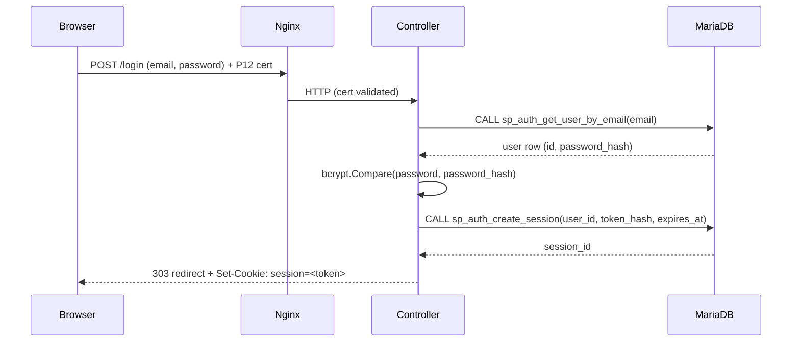
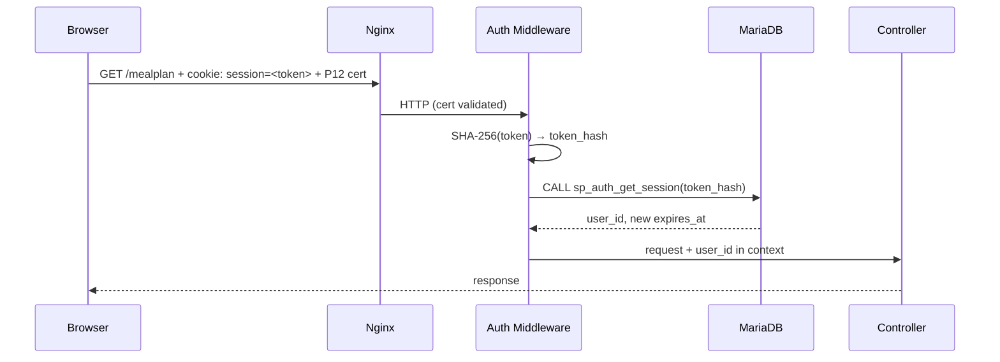

# Authentication

Foodaura uses two independent layers of access control:

1. **mTLS perimeter (Nginx)** — every request must carry a valid P12 client certificate. Requests without one are rejected before reaching the backend. This is a temporary hardening measure while pre-production; see [Design Decisions § mTLS](5.%20Design%20Decisions.md).
2. **Session-based identity (backend)** — once inside the perimeter, the backend identifies *who* the request belongs to via a session cookie set at login.

The P12 cert controls *access to the app*. The session cookie controls *who you are inside it*. They are independent — the cert carries no identity information the backend uses.

---

## Login Flow



**Session token generation (Go):**
```
token  = crypto/rand → 32 bytes → hex-encoded (64-char string)
stored = SHA-256(token) → stored in sessions.token_hash
cookie = raw token (never the hash)
```

The raw token lives only in the cookie. The database stores only the hash — if the database is ever compromised, raw tokens are not exposed.

---

## Per-Request Auth (Middleware)

Every route except `POST /login` is wrapped by auth middleware.



If `sp_auth_get_session` returns no row (token not found or expired), the middleware returns `401 Unauthorized` and the request does not reach the controller.

---

## Logout Flow

```mermaid
sequenceDiagram
    participant B as Browser
    participant N as Nginx
    participant C as Controller
    participant DB as MariaDB

    B->>N: POST /logout + cookie: session=<token> + P12 cert
    N->>C: HTTP (cert validated)
    C->>DB: CALL sp_auth_delete_session(token_hash)
    C-->>B: 303 redirect to /login + Set-Cookie: session=; Max-Age=0
```

---

## Session Specification

| Property | Value |
|---|---|
| **Duration** | 30 days from last activity |
| **Expiry type** | Rolling — `expires_at` is extended to `NOW() + 30 days` on every authenticated request |
| **Token format** | 32 bytes from `crypto/rand`, hex-encoded → 64-char string |
| **Stored as** | SHA-256 hash of the raw token (`sessions.token_hash`) |
| **Cookie name** | `session` |
| **HttpOnly** | `true` — not accessible via JavaScript |
| **Secure** | `true` — HTTPS only |
| **SameSite** | `Strict` — not sent on cross-site requests |
| **Path** | `/` |
| **Max-Age** | `2592000` (30 days in seconds) |

---

## Routes

| Method | Path | Protected | Description |
|---|---|---|---|
| `POST` | `/login` | No | Verify credentials, create session, set cookie |
| `POST` | `/logout` | Yes | Delete session, clear cookie |
| `*` | `/*` | Yes | All other routes require a valid session |

---

## Key Notes

- **Rolling expiry in the DB:** `sp_auth_get_session` extends `expires_at` to `NOW() + 30 days` on every call. The cookie `Max-Age` is reset to 30 days in the response header on every request so the browser expiry stays in sync.
- **No JWT.** Sessions are server-side. The backend is the authority on whether a session is valid — there is no token the client can self-validate.
- **No "remember me" toggle.** All sessions are 30 days rolling. There is no short-lived session option.
- **Single session per login.** Each login creates a new session row. A user can have multiple active sessions (e.g. from different devices). Logout deletes only the current session.
